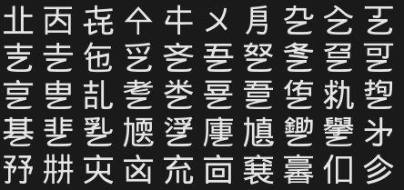

# fonttable
Print out every¹ unicode character, see all possible glyphs in your terminal

¹ Well... not quite *every* character. We don't want control codes
and such, so general classes `C`, `M`, and `Z` won't be printed. (See the
table of general category values at the end of the script.)
 
If you don't have `/usr/share/unicode/UnicodeData.txt` on your system,
a version cached in this script will be automatically used. 
(v11.0.0d12, current as of Feb 19, 2018 from unicode.org).

Additionally: the Unicode Consortium's "UnicodeData.txt" file does
not list CJK characters, but they can be found in the adjacent
Unihan database. If you'd like to see them as well, specify "-s" 

## Notes

1. This was inspired by the favorite 8-bit one-liner of many a youth:
   
         FORT=0TO255:?CHR$(T);:RUN 

2. This is the modern equivalent, a way to see every valid glyph.
   Of course, we can't use a simple loop since Unicode has a huge
   address space and only a small fraction of the code points are
   valid characters. The solution is to only print characters
   specified in the UnicodeData.txt file.

3. Likewise, not every CJK code point in the allocated UNIFIED
   IDEOGRAPH range is a character. Fonttable prints only characters
   that the Unihan database knows exist. (Unihan_DictionaryIndices.txt).
   
4. As of Unicode 11 (2018), I count 27,000 printable characters in
   UnicodeData.txt. Additionally, there are 70,000 known CJK
   characters in the Unihan database.

        $ ./fonttable -s | awk '{print length($1)}'
        27006
        70792

    (Some people claim much higher numbers because they are using
    PropList.txt and counting *allocated* regions, whether or not
    characters exist at those code points.)

## Usage

    fonttable [ -c ] [ -s ] [ -u ] 
        -c | --cache
                Use cached UnicodeData.txt embedded in this script.
                Usually the cached version is only used if the file is
                not in /usr/share/unicode/ or the current directory.
        -s | --show-unihan
                Also show CJK data from the Unihan database.
                The default is to not show characters that Unicode has
                designated as mappings to other standards.
        -u | --unihan-cache
                Use a cached copy of the list of valid CJK characters
                instead of looking for Unihan_DictionaryIndices.txt.

        UnicodeData.txt contains about 30,000 characters.
        Unihan adds another 70,000.

____

# YMMV

Different terminal programs and fonts will give you drastically
different results.

## Gnome Terminal 

For example, Gnome-Terminal-3.18.3 appears to fall back to proportional fonts for code points not in its default font, causing it to have overlapping glyphs. There is no setting to tell it not to do this:

While messy, this does have the benefit of ensuring that any Unicode character you come across will be shown. (Assuming you have a font for it, of course). 

## Xterm
Xterm handles this in a different way. Instead, it will use only the single font you specify. That means you'll need to find one font that covers every section of Unicode you use. This can be rather tricky.

### For bitmap fonts

The default xterm font, called "fixed", seems terrible as it has very few Unicode characters, but that is because xterm uses the Latin-1 version by default. There is a Unicode (10646) version of "fixed" which is not bad in terms of coverage. "Fixed" also comes in a wide version for Asian characters, which xterm automatically detects and uses.

    xterm  -fn '*fixed-medium-r-normal--20*10646*' 
    

### For antialiased fonts

You can also use xterm's capability to use TrueType fonts, which gives you have a much greater selection. You'll want to specify the "doublesize" font separately if xterm doesn't automatically detect it.

    xterm  -fa DroidSansMono  -fd DroidSansFallback
    

