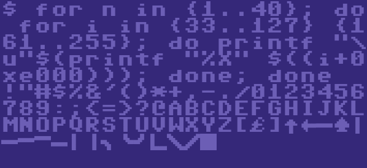
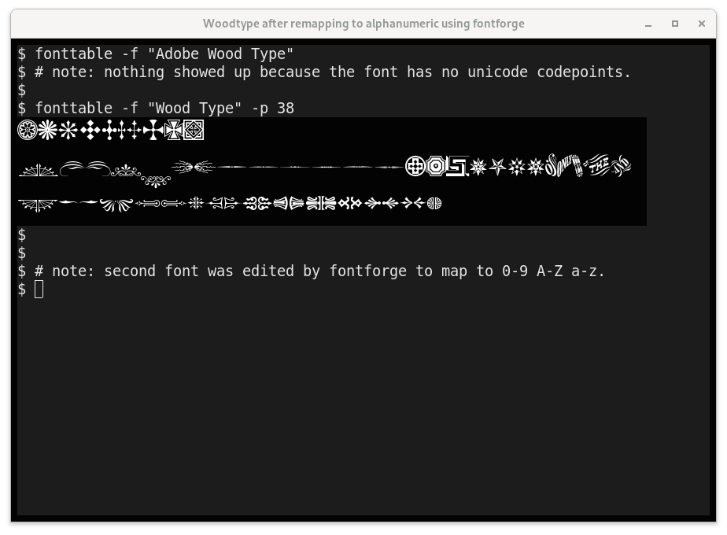
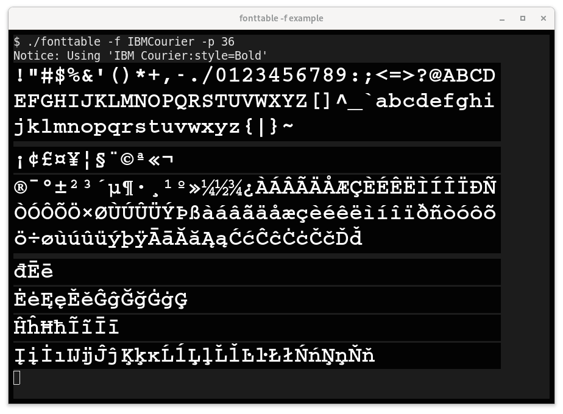
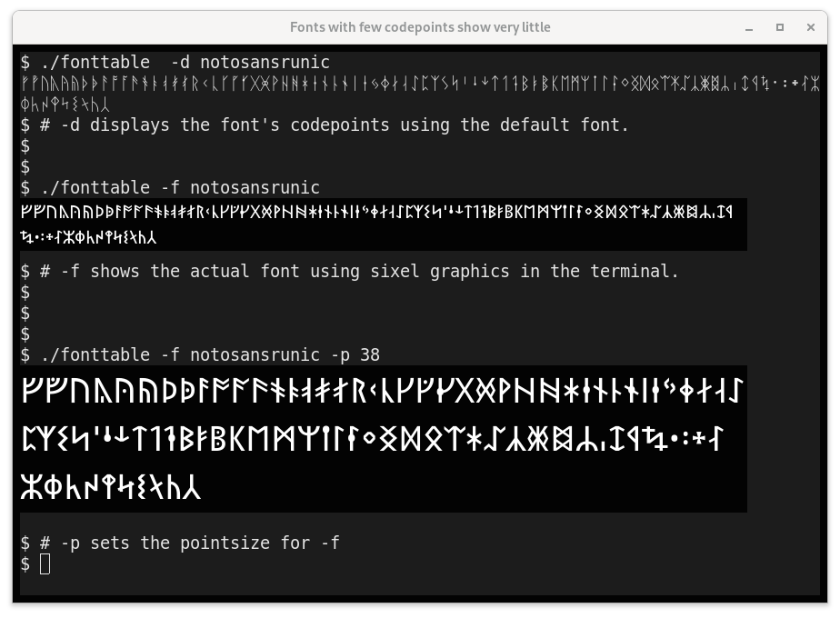

# fonttable
Print out every¹ unicode character; see all possible glyphs in your terminal

¹ Well... not quite *every* character. We don't want control codes
and such, so characters in categories `C`, `M`, and `Z` won't be printed. (See the table of [general category values](http://unicode.org/reports/tr44/#GC_Values_Table) at the end of the script.)
 
If you don't have [`/usr/share/unicode/UnicodeData.txt`](http://unicode.org/Public/UNIDATA/UnicodeData.txt) on your system, a version cached in this script will be automatically used. (v14.0.0, current as of September 2021 from unicode.org).

While fonttable sends all printable Unicode characters to stdout, what
characters are _actually_ displayed depends upon what fonts you have
installed on your system and if your terminal is setup to use them.

Optionally, one can specify a particular font using -f fontname
to restrict the display to glyphs defined in that font.
(Requires fontconfig and sixel graphics.)

Note: the Unicode Consortium's ["UnicodeData.txt"](http://unicode.org/Public/UNIDATA/UnicodeData.txt) file does not list CJK characters, but they can be found in the adjacent [Unihan](http://unicode.org/Public/UNIDATA/Unihan.zip) database. If you'd like to see them as well, specify "-s" 

## Installation

It's a shell script. Just download
[`fonttable`](https://github.com/hackerb9/fonttable/blob/master/fonttable?raw=true)
and run it. 

## Notes

1. This was inspired by the favorite 8-bit one-liner of many a youth:
    <video>
    <source src="README.md.d/c64xterm.mp4" type="video/mp4">
    
    </video> 

         FORT=0TO255:?CHR$(T);:NEXT:RUN 

2. This is the modern equivalent, a way to see every valid glyph.
   Of course, we can't use a simple loop since Unicode has a huge
   address space and only a small fraction of the code points are
   valid characters. The solution is to only print characters
   specified in the UnicodeData.txt file.

3. Likewise, not every CJK code point in the allocated UNIFIED
   IDEOGRAPH range is a character. Fonttable prints only characters
   that the Unihan database knows exist. (Unihan_DictionaryIndices.txt).
   
4. As of Unicode 14 (2021), I count almost 32,000 printable characters
   in UnicodeData.txt. Additionally, there are over 70,000 known CJK
   characters in the Unihan database.

        $ ./fonttable -s | awk '{print length($1)}'
        31959
        70805

    (Some people claim much higher numbers because they are using
    PropList.txt and counting *allocated* regions, whether or not
    characters exist at those code points.)

## Usage

	fonttable: Show every Unicode character in your terminal.

	Usage: fonttable [ -csu ] [ START..END ] [ -f FONT [ -p POINTSIZE ]]

		START..END
			Show range from START to END, inclusive. (Hexadecimal).
			START defaults to 0, END defaults to infinity.
			Multiple ranges are allowed: fonttable 2590..f 1fb00..ff

		-f FONT | --font-name FONT
			Display every Unicode glyph which is defined in FONT as
			a sixel image directly in the terminal. 

		-p POINTSIZE | --point-size POINTSIZE
			Change the size of the font rendered by -f.
			
		-d FONT | --defined-in FONT
			Like -f, but displays using the default terminal font,
			not graphics. Useful to quickly see character coverage.

		-c | --cache
			Use cached UnicodeData.txt embedded in this script.
			Usually the cached version is only used if the file is
			not in /usr/share/unicode/ or the current directory.

		-s | --show-unihan
			Also show CJK data from the Unihan database.
			The default is to not show characters that Unicode has
			designated as mappings to other standards.

		-u | --unihan-cache
			Use a cached copy of the list of valid CJK characters
			instead of looking for Unihan_DictionaryIndices.txt.

	UnicodeData.txt contains around 30,000 characters.
	Unihan adds another 70,000.
____

## About --font-name

The -f / --font-name option is like the range option, but it shows
only the codepoints that are defined in a specific font (and that are
marked as normal, printable characters in Unicode). For example:

    fonttable -f NotoSans

Fonts may be specified by filename:

    fonttable -f /usr/share/fonts/X11/misc/neep-iso10646-1-10x20.pcf.gz 

### Caveat 1: Requires sixel graphics to display in the named font

Fonttable uses sixel graphics to draw the font requested. Use the 
`-d FONT` option if you would like to use a specific font to limit which
codepoints are displayed, but still show them in the default font.

BUG: Currently the sixel handling is quite naive. The terminal is not
queried if it supports sixels graphics, nor how many pixels high each
character should be, nor the proper text colors.

### Caveat 2: FontConfig is required

Your machine must have FontConfig, which will be true for Debian
GNU/Linux and derivatives, but may not be true universally.
Additionally, the fontname must in a format FontConfig likes. For
example:

    fonttable -f LTCCaslon                          # Works
    fonttable -f "LTC Caslon"                       # Works
    fonttable -f "LTC Caslon Swash Long Regular"    # Works

But, as it happens:

    fonttable -f Caslon                     # Does Not Work 
    fonttable -f "LTC Caslon Swash Long"    # Does Not Work

If you are unsure of the name, try `fc-list | grep -i caslon`. You may
also specify a font filename directly. For example:

    fonttable ~/.local/share/fonts/P22CezannePro.ttf

### Caveat 3: Decorative and expert fonts

Some decorative and expert fonts define glyphs that do not have
mappings to Unicode codepoints or that map to Private Use. Those
characters will not be found by this script. For example:

	fonttable -f AdobeWoodType		# Shows no glyphs!

However, with some effort, one can move such glyphs to Unicode code
points using a program such as FontForge.

____

# YMMV

Different terminal programs and fonts will give you drastically
different results.

**XXX TODO**

This section needs to be redone as the terminals tested are now quite old.

## Sixel output (on XTerm)

## Gnome Terminal 

Gnome-Terminal-3.38.3 uses multiple fonts using FreeType. For some
characters, such as ⑫ (Circled Number Twelve) the glyphs are too wide
for the character cell and overlap badly. There appears to be no
setting to tell Gnome-Terminal to shrink or truncate overly wide
glyphs.

Gnome Terminal has very few user settable preferences, but you can set
"Ambiguous Width" characters to be wide (two cells) instead of narrow.
This helps quite a bit, at least on this torture test. 

However, setting ambiguous-width to wide is not a panacea. For example, if the glyph is being replaced by a font of a very different aspect ratio from your default. For example, here is what happens when the "DEC Terminal" font is chosen (which is twice as high as it is wide):

Notice that with this default font, glyphs are overlapping even though
ambiguous-width is set to wide.

## Xterm

Like gnome-terminal, Xterm also uses multiple fonts when an
antialiased (vector) font is selected (`-fa Inconsolata -fs 18`),
filling in with other system fonts if the selected font is too
limited. Xterm can also work with bitmaps fonts, but they are a little
trickier.

### For bitmap fonts

Xterm will use only a single font if you specify a bitmap font using
`-fn`. That means you'll need to find one font that covers every
section of Unicode you use. This is not always easy.

The default xterm font, called "fixed", seems a terrible choice as it
has very few Unicode characters. However, that is because xterm uses
the Latin-1 version by default. There is a Unicode (10646) version of
"fixed" which is not bad in terms of coverage. "Fixed" also comes in a
wide version for Asian characters, which xterm automatically detects
and uses. So, not a bad choice, and it comes pre-installed.

    xterm  -fn '*fixed-medium-r-normal--20*10646*' 
    

### For antialiased fonts

XTerm already fills in missing glyphs for you by using other fonts
when you specify an antialiased font using `-fa`. (Use `-fs` to specify
the point size). Note: _Antialiased_ is how XTerm refers to vector
fonts like TrueType, OpenType, and Type 1.

While XTerm and GNOME-Terminal both use FreeType to render antialiased
fonts, unlike GNOME-terminal, XTerm enforces character cell boundaries
and does not let glyphs overlap. Instead, overly wide glyphs are
truncated. Whether this is better or not is a matter of taste. 

Note that XTerm defaults to using the font color specified by the user
rather than colors builtin to a font. Again, this is a matter of
taste, but it should be noted that most emoji fonts nowadays are
designed *only* in color, so single color fonts for certain ranges may
look outdated or be missing glyphs.

#### Debugging XTerm Antialiased fonts

If you wish to see which fonts are getting loaded as you run
fonttable, set the XFT_DEBUG environment variable to 3 before running
xterm. 

    XFT_DEBUG=3 xterm -fa DroidSansMono -fs 24

If you wish to force xterm to use *only* the fonts you requested, you
can do so by setting the `limitFontsets` X resource to 0.

    xterm -fa DroidSansMono -xrm "XTerm*vt100.limitFontsets: 0"
    
Note that xterm will attempt to automatically detect if your font is
also available in a doublesize version (for CJK). If it doesn't find
it, you can specify a separate "doublesize" font using `-fd`.

    xterm -fs 24 -fa DroidSansMono -fd DroidSansFallback -xrm "XTerm*vt100.limitFontsets: 0"
    
Note that if you don't have a particular font installed, even if you
use limitFontsets: 0, you will be shown a substitute font. Again, you
can use XFT_DEBUG to find out what is going on.

    XFT_DEBUG=3 xterm -fs 24 -fa DroidSansMono -fd DroidSansFallback -xrm "XTerm*vt100.limitFontsets: 0"
    

